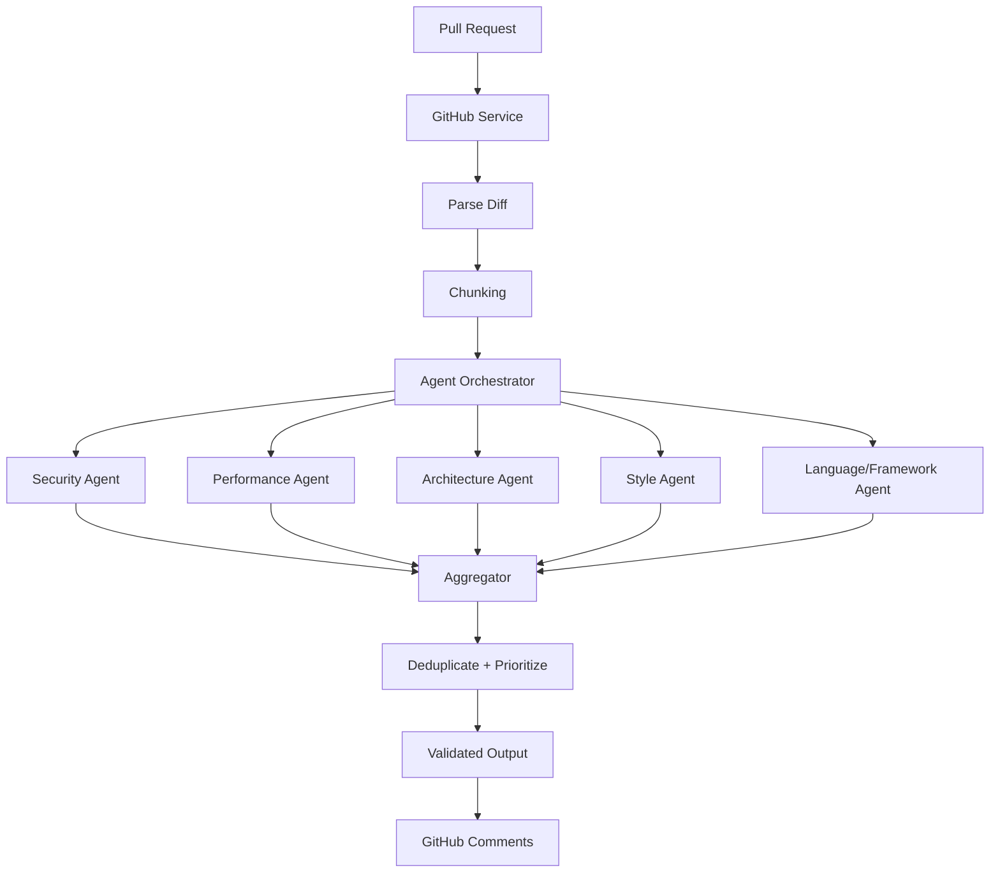
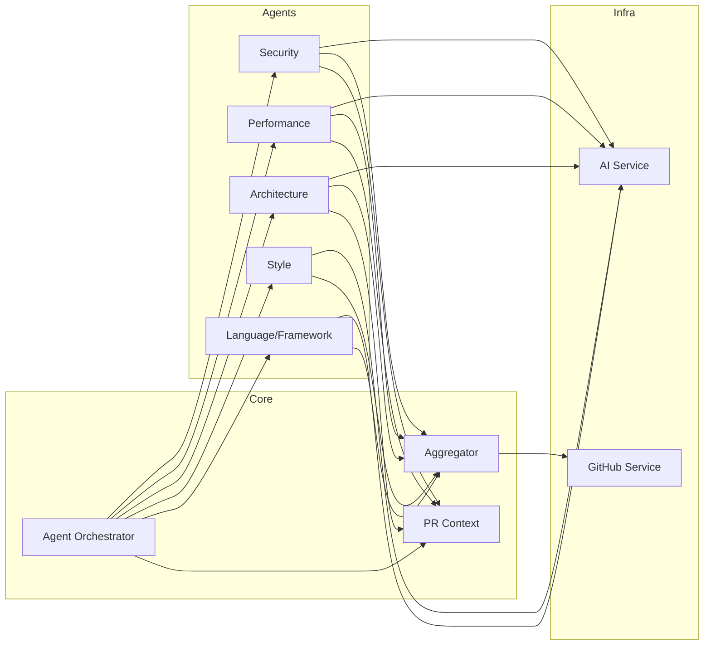
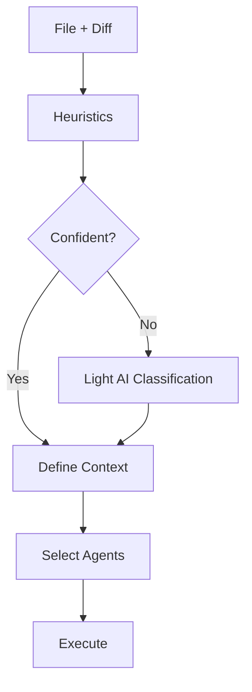
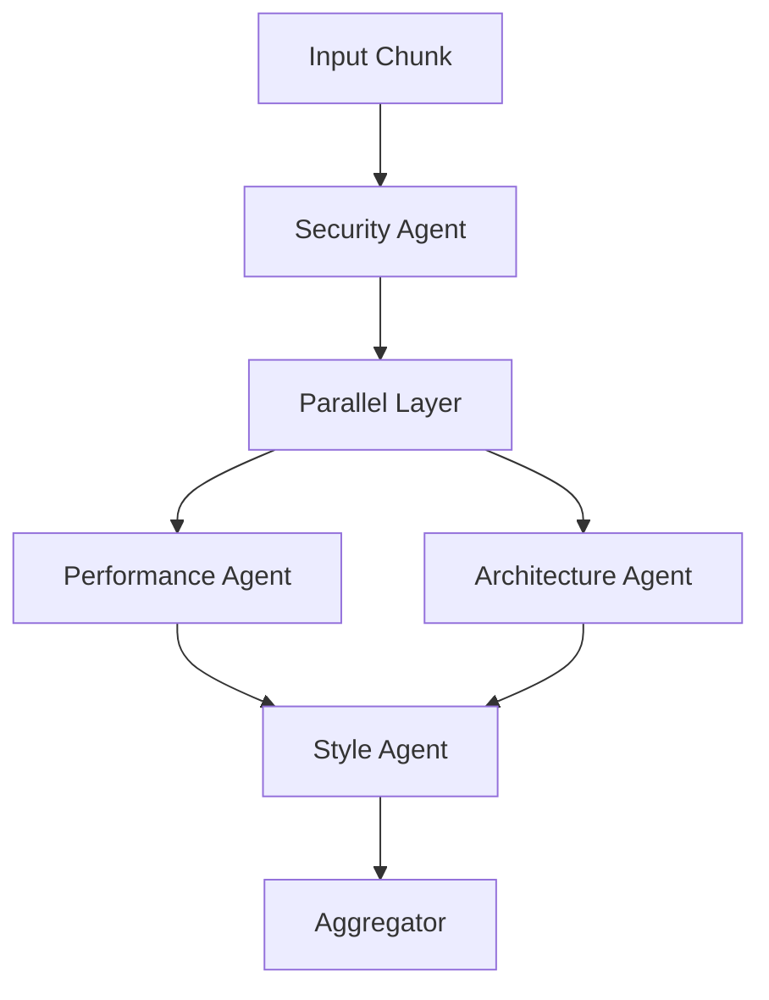
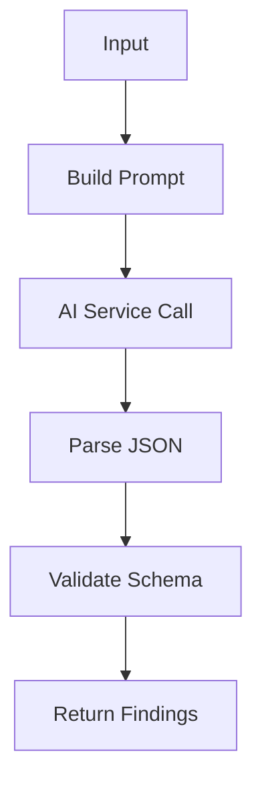
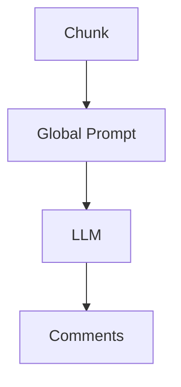
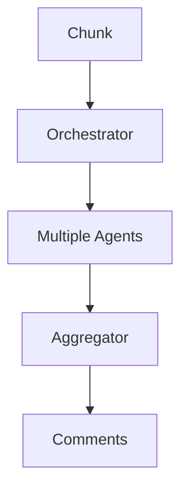
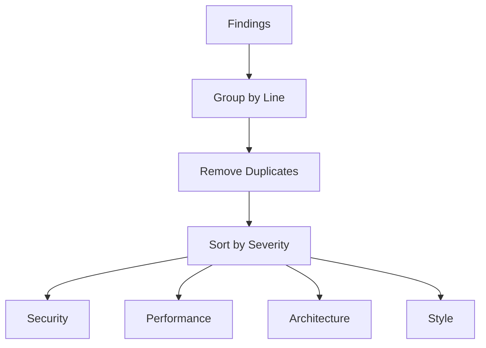

# 📄 Product Design Review (PDR)

## AI Code Reviewer - Arquitetura de Agentes Especializados

---

## 1. 🎯 Objetivo

Construir uma GitHub Action inteligente capaz de revisar Pull Requests de forma automatizada, com alta precisão, baixo custo e adaptável a múltiplas linguagens e frameworks.

O sistema deve evoluir de um modelo monolítico baseado em prompt para uma arquitetura modular baseada em agentes especializados.

---

## 2. 🧠 Estado Atual (As-Is)

### Arquitetura

Pipeline linear:

PR → diff → chunking → loop por chunk → LLM → validação → comentários

### Características

* Uso de um único prompt com guidelines globais
* Execução por chunk de código
* Controle de concorrência
* Validação de saída (Zod)
* Retry com backoff

### Problemas Identificados

1. Repetição de contexto em cada chamada
2. Falta de especialização (modelo “faz-tudo”)
3. Alto consumo de tokens
4. Ausência de priorização (segurança vs estilo)
5. Falta de contexto global do PR
6. Baixa adaptabilidade a múltiplas linguagens

---

## 3. 🚀 Visão (To-Be)

### Conceito: “Conselho de Agentes”

Sistema composto por múltiplos agentes especializados que analisam o código de forma direcionada.

### Objetivos da Nova Arquitetura

* Reduzir custo de tokens
* Aumentar precisão das análises
* Permitir escalabilidade por linguagem/framework
* Melhorar organização e manutenção

---

## 4. 🧩 Arquitetura Proposta

### 4.1 Agent Orchestrator

Responsável por:

* Triage (decidir quais agentes usar)
* Execução dos agentes
* Consolidação dos resultados

### 4.2 Fluxo

PR → diff → chunking → Orchestrator → Agents → Merge → Output

---

## 5. 🧠 Triage (Componente Crítico)

### Função

Determinar:

* Linguagem
* Framework
* Tipo de arquivo
* Agentes a serem acionados

### Estratégia

#### Camada 1: Heurística

* Extensão de arquivo
* Path (ex: /api, /infra)
* Palavras-chave no diff

#### Camada 2: IA (opcional)

* Usada apenas quando heurística falhar

---

## 6. 🤖 Tipos de Agentes

### 6.1 Agentes Genéricos

* Security Agent
* Performance Agent
* Architecture Agent
* Style Agent

### 6.2 Agentes Específicos (por linguagem/framework)

* Node Agent
* Python Agent
* Java Agent
* Frontend Agent (React/Vue)
* Infra Agent (Terraform/Docker)

---

## 7. 🧾 Prompt Strategy

### Antes

* Prompt único com todas as regras

### Depois

* Prompt mínimo + regras específicas por agente
* Contexto adaptado por linguagem

Exemplo:

“You are reviewing a TypeScript backend using NestJS...”

---

## 8. 🔀 Execução

### Estratégia Híbrida

* Security → primeiro
* Performance + Architecture → paralelo
* Style → último

### Controle

* Limite de concorrência
* Budget por PR

---

## 9. 🧠 Contexto Compartilhado

### PRContext

Contém:

* Arquivos modificados
* Padrões detectados
* Resultados anteriores

Permite:

* Evitar duplicação
* Melhor consistência

---

## 10. 🔗 Merge de Resultados

Problema:

* Conflitos entre agentes
* Duplicações

### Solução

Aggregator com:

* Deduplicação
* Priorização

### Ordem de Severidade

Security > Performance > Architecture > Style

---

## 11. 🌍 Suporte Multi-Linguagem

### Estratégia

* Detectar linguagem por extensão
* Detectar framework por heurística
* Adaptar prompts dinamicamente

### Abordagem

Híbrida:

* Genérico + Específico

---

## 12. 💰 Custo & Performance

### Riscos

* Aumento de chamadas (fan-out)

### Mitigações

* Triage agressivo
* Redução de tokens por agente
* Cache por diff
* Limite de concorrência

---

## 13. 🧪 Plano de Verificação

### Automatizado

* Testes com múltiplos tipos de PR
* Medição de tokens

### Manual

* Qualidade dos comentários
* Redução de falsos positivos

### Consistência

* Rodar múltiplas vezes
* Comparar resultados

---

## 14. 🧱 Roadmap de Implementação

### Fase 1

* Introduzir Orchestrator
* Criar 2 agentes (Security + General)

### Fase 2

* Separar guidelines
* Remover prompt global

### Fase 3

* Adicionar agentes especializados

### Fase 4

* Implementar Aggregator

---

## 15. 🔮 Evolução Futura

* Meta-Agent (revisor final)
* Aprendizado com feedback
* Ranking de severidade inteligente

---

## 16. ⚖️ Trade-offs

| Abordagem    | Prós          | Contras            |
| ------------ | ------------- | ------------------ |
| Monolítico   | Simples       | Baixa qualidade    |
| Multi-agente | Alta precisão | Complexidade       |
| Híbrido      | Balanceado    | Requer arquitetura |

---

## 17. 🧠 Insight Final

Este sistema não é apenas um revisor de código.

É um sistema de decisão contextual baseado em código.

---

## 18. 📌 Próximos Passos

* Revisão com equipe
* Definição de interfaces
* Implementação incremental

---

(Documento vivo - deve ser atualizado continuamente)

---

## 19. 🧭 Diagramas

### 19.1 Fluxo Geral do Sistema

---

### 19.2 Arquitetura de Componentes

---

### 19.3 Triage e Seleção de Agentes

---

### 19.4 Execução dos Agentes (Híbrido)

---

### 19.5 Fluxo Interno de um Agente

---

### 19.6 Pipeline Atual vs Novo

#### Atual

#### Novo

---

### 19.7 Priorização de Resultados

---

(Os diagramas utilizam Mermaid e podem ser renderizados em ferramentas compatíveis como GitHub, Notion ou VSCode)

---

## 20. 🧠 Análise de Consenso e Refinamento Técnico

Após revisão e discussão, os seguintes pilares foram consolidados como fundamentais para o sucesso da implementação:

### 20.1 Arquitetura Fan-out / Fan-in
O sistema operará em um modelo de "Funil Reverso":
* **Fan-out (Expansão)**: O Orchestrator distribui a carga para múltiplos especialistas de forma inteligente.
* **PR Context (A Medula)**: Estado compartilhado e vivo que serve de memória central para os agentes, evitando redundância e garantindo que as opiniões dos especialistas sejam coesas.
* **Fan-in (Consolidação)**: O Aggregator atua como um "Editor-Chefe", recebendo os achados brutos e refinando-os para o desenvolvedor final.

### 20.2 Triage e "Cache de Decisão"
A Camada de Heurísticas funciona como um "Cache de Decisão" de baixo custo. A IA de classificação (Layer 2) é acionada estritamente em cenários de alta ambiguidade, protegendo a cota de tokens do projeto.

### 20.3 Cascata Híbrida de Execução
A ordem de execução reflete uma hierarquia clara de prioridades técnicas:
1. **Segurança (Gatekeeper)**: Foco primário na integridade e blindagem do código.
2. **Lógica e Performance (Paralelo)**: Foco em eficiência, corretude e redução de dívida técnica.
3. **Estilo (Finalizador)**: Foco em consistência visual e padrões de nomenclatura.

### 20.4 Algoritmo de Agrupamento por Linha
O Aggregator possui inteligência para agrupar achados concorrentes na mesma linha. Ele é responsável pela deduplicação e pela aplicação da regra de severidade (`Security > Performance > Architecture > Style`), garantindo que a notificação mais crítica sempre prevaleça.

### 20.5 Padronização e Extensibilidade
A estrutura interna dos agentes é padronizada (`Build -> Call -> Parse -> Validate`). Isso assegura que o sistema seja agnóstico à implementação e facilmente extensível para novas linguagens ou frameworks (Rust, Terraform, Go) através de injeção de novas classes de agentes sem alteração no Core.
