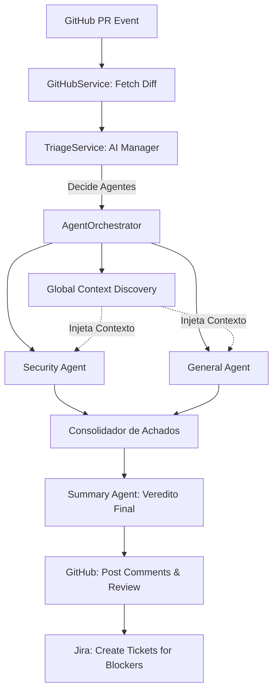

# Plano de Estudo: AI Code Reviewer (Council of Agents)

Este documento foi criado para capacitar desenvolvedores e líderes técnicos a entender, apresentar e implementar o **AI Code Reviewer**. Ele serve como um roteiro didático e técnico, cobrindo desde a proposta de valor até as entranhas da arquitetura.

---

## 📑 Sumário
1. [Visão Geral e Proposta de Valor](#1-visão-geral-e-proposta-de-valor)
2. [Arquitetura: O Conselho de Agentes](#2-arquitetura-o-conselho-de-agentes)
3. [Mergulho Técnico: Componentes Core](#3-mergulho-técnico-componentes-core)
4. [Inteligência e Contexto Global](#4-inteligência-e-contexto-global)
5. [Integrações (GitHub, Jira, AI)](#5-integrações-github-jira-ai)
6. [Guia de Implementação e Customização](#6-guia-de-implementação-e-customização)
7. [Próximos Passos e Evolução](#7-próximos-passos-e-evolução)

---

## 1. Visão Geral e Proposta de Valor
### O Problema
Code reviews humanos são caros, lentos e propensos a fadiga. Erros de segurança e quebras de padrão de projeto muitas vezes passam despercebidos em PRs grandes.

### A Solução
Um bot de revisão de código que não apenas usa IA para ler texto, mas utiliza um **Conselho de Agentes Especialistas** coordenados para analisar segurança, performance, arquitetura e impactos globais no repositório.

### O que a ferramenta oferece:
- **Revisão Multidisciplinar:** Agentes focados em Segurança (OWASP) e Clean Code.
- **Consciência Global:** Detecta se uma mudança em um arquivo quebra contratos em outros arquivos.
- **Integração com Jira:** Transforma achados críticos ("BLOCKING") em tickets automaticamente.
- **Baixo Ruído:** Sistema de triage que decide quais agentes devem rodar, economizando tempo e tokens.

---

## 2. Arquitetura: O Conselho de Agentes
A arquitetura é baseada no padrão **Orchestrator-Workers**. 

### Fluxo de Execução

---

## 3. Mergulho Técnico: Componentes Core

### 3.1. O Gerente (TriageService)
Localizado em `src/services/triage.service.ts`.
- **Função:** Analisa o arquivo e o diff antes de qualquer revisão.
- **Output:** Decide se precisa de um especialista em segurança, performance ou arquitetura. Identifica "Símbolos de Impacto" (ex: uma função pública alterada).

### 3.2. O Orquestrador (AgentOrchestrator)
Localizado em `src/services/agent.orchestrator.ts`.
- **Função:** Coordena a execução paralela dos agentes.
- **Diferencial:** Implementa a **Deduplicação**. Se dois agentes encontrarem o mesmo problema, o orquestrador consolida em um único comentário para não poluir o PR.

### 3.3. Os Especialistas (Agents)
Localizados em `src/agents/`.
- **BaseAgent:** Classe abstrata que define o contrato de um agente.
- **SecurityAgent:** Focado em vulnerabilidades, SQL injection, vazamento de secrets.
- **GeneralAgent:** Focado em Clean Code, SOLID, e lógica de negócio.

---

## 4. Inteligência e Contexto Global
Este é o recurso mais avançado da ferramenta. A maioria dos bots de IA olha apenas para o arquivo alterado. O nosso bot faz o seguinte:

1. **Identifica Símbolos:** O Triage detecta que a função `updateUser` foi alterada.
2. **Busca Ativa:** O `AgentOrchestrator` usa a API de busca do GitHub para encontrar onde `updateUser` é usada em **todo o repositório**.
3. **Injeção de Contexto:** Os agentes recebem snippets desses usos externos.
   - *Exemplo de insight:* "Você alterou o parâmetro X na função Y, mas detectamos que o arquivo `auth.service.ts` ainda a chama sem esse parâmetro."

---

## 5. Integrações (GitHub, Jira, AI)

### GitHub Service (`src/services/github.service.ts`)
- Gerencia a complexidade de postar comentários em linhas específicas.
- Implementa o **Upsert de Sumário**: O bot mantém apenas um comentário de resumo que ele atualiza, evitando "spam" de comentários a cada novo commit.

### Jira Service (`src/services/jira.service.ts`)
- Conecta achados técnicos ao fluxo de gestão.
- Regra de Negócio: Apenas achados marcados como `BLOCKING` geram tickets.

### AI Service (`src/services/ai.service.ts`)
- Abstração que permite trocar de modelo (GPT-4, Gemini, Claude) facilmente, desde que a API seja compatível com o padrão OpenAI.

---

## 6. Guia de Implementação e Customização

### Como implementar em um novo projeto:
1. **GitHub Action:** Criar um arquivo `.github/workflows/ai-review.yml`.
2. **Secrets:** Configurar `AI_API_KEY`, `GITHUB_TOKEN` e, se necessário, as credenciais do Jira.
3. **Regras Customizadas:** O bot aceita um parâmetro `CUSTOM_RULES` (via ENV ou arquivo). Isso permite injetar o guia de estilo específico da sua empresa (ex: "Sempre use CamelCase para variáveis").

### Configurações Importantes:
- `IGNORE_FILES`: Padrões de arquivos para ignorar (ex: `*.md`, `dist/*`).
- `AI_MODEL`: Escolher entre modelos mais rápidos (gpt-4o-mini) ou mais inteligentes (gpt-4o).

---

## 7. Próximos Passos e Evolução
Para apresentar a líderes técnicos, destaque as possibilidades de expansão:
- **Agente de Testes:** Um agente dedicado a verificar se os testes unitários cobrem a nova lógica.
- **Agente de Documentação:** Verificar se o README ou Swagger foi atualizado conforme o código mudou.
- **Fine-tuning:** Treinar modelos com o histórico de PRs aprovados da empresa para aprender o "jeito da casa".

---
*Este guia foi gerado para auxiliar na disseminação de boas práticas de engenharia e automação com IA.*
